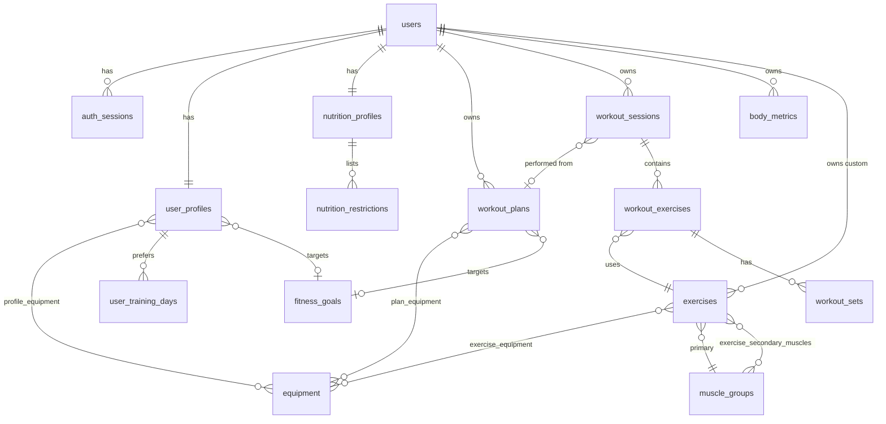

# Database

SQLite via SQLAlchemy 2. Tables are created at startup (`Base.metadata.create_all`). Foreign keys are enforced
(`PRAGMA foreign_keys=ON` on every connection). Closed vocabularies are VARCHAR columns with CHECK constraints.
Timestamps are stored as UTC and returned timezone-aware.

## Tables

| Table | Purpose / notable columns |
| --- | --- |
| `users` | `email` (unique), `password_hash`, `is_active`, timestamps |
| `auth_sessions` | `token_hash` (unique), `expires_at`. Deleted on logout/expiry or with the user |
| `user_profiles` | One per user. Every field optional: `age`, `height_cm`, `weight_kg`, `sex`, `experience_level`, `goal_id`, `activity_level`, `training_location`, `training_days_per_week`, `preferred_workout_minutes`, `unit_preference` |
| `user_training_days` | Preferred weekdays (0 = Monday), one row per day |
| `profile_equipment` | Which equipment a user has (many-to-many) |
| `fitness_goals` | Lookup: fat loss, muscle gain, recomposition, strength, general fitness. Add rows to add goals |
| `equipment` | Lookup: barbell, dumbbells, cable machine, bench, squat rack, pull-up bar, resistance bands, kettlebell, machines, bodyweight |
| `muscle_groups` | Lookup used for primary/secondary muscles |
| `exercises` | `owner_user_id` NULL = built-in, otherwise a private custom exercise. `movement_pattern`, `difficulty`, `exercise_type`, `instructions`, `is_active`; Phase 1: `min_experience_level`, `is_compound`, `is_timed` (rep range is seconds), `rep_min`, `rep_max`, `recommended_sets` |
| `exercise_equipment` | Equipment an exercise needs. **All** linked items are required; no rows = no equipment |
| `exercise_secondary_muscles` | Secondary muscles (many-to-many) |
| `workout_plans` | `name`, `kind` (generated, custom), `split_type`, `goal_id`, `days_per_week`, `experience_level`, `duration_minutes`, `training_location`, `notes` (generator warnings), `is_active`, created/updated |
| `plan_days` | A day in a plan's weekly cycle: `day_index` (1-7, unique per plan), `name`, `focus`, `is_rest` |
| `plan_exercises` | Exercise in a day with its prescription: `position`, `sets`, `rep_min`, `rep_max`, `rest_seconds`, `notes` |
| `plan_equipment` | Equipment a plan requires |
| `workout_sessions` | `name`, `performed_on`, `plan_id` / `plan_day_id` (nullable, cleared if the plan is deleted), `started_at`, `ended_at`, `duration_minutes`, `status` (planned, in_progress, completed, skipped), `notes`. A partial unique index allows one `in_progress` session per user |
| `workout_exercises` | Exercise within a session, ordered by `position` (unique per session); `rest_seconds` (prescribed) |
| `workout_sets` | `set_number`, `weight_kg`, `reps`, `rpe`, `rir`, `rest_seconds`, `notes`, `target_reps_min`/`target_reps_max` (from the plan), `is_completed` |
| `body_metrics` | One row per measurement: `metric_type` (weight, body_fat, waist, chest, arm, thigh, hip, neck, custom), `custom_label`, `value`, `unit`, `recorded_at`. Indexed by user, type and time |
| `nutrition_profiles` | One per user: `calorie_target`, `protein_g`, `carbs_g`, `fat_g`, `dietary_preference` |
| `nutrition_restrictions` | Allergies and restrictions as rows (`kind`, `label`) |

## Design notes

- History is relational (sessions, exercises, sets, metrics are all rows), so later analytics can query it
  directly. No important data lives in JSON blobs.
- Deleting a user cascades to everything they own.
- Migrations: the app uses `create_all` for new tables, plus `app/migrate.py`, an idempotent upgrader that adds the
  Phase 1 columns (and the one-active-session index) to an existing Phase 0 database on startup. It only ever adds
  columns. Adopt Alembic before any rename, drop or type change.
- The built-in exercise library in `app/seed_data/exercise_library.py` is the source of truth: startup adds new
  entries and re-syncs the metadata of existing built-ins. Custom (user-owned) exercises are never touched.

## Reset local data

Stop the server and delete `backend/liv.db`. It's recreated on next start.
